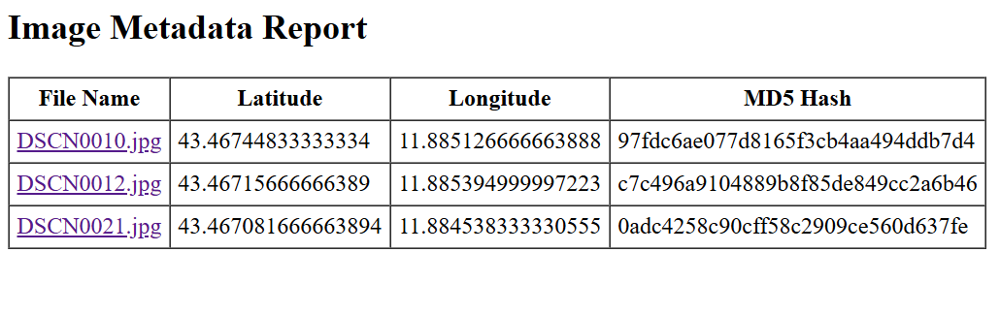
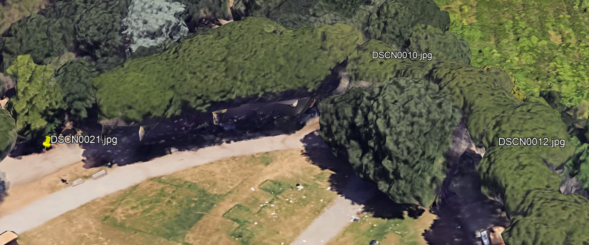

# eXifMarksTheSpot

**eXifMarksTheSpot** is a digital forensics tool designed to extract and visualize geolocation and metadata from image files. It scans a folder of JPEG images, retrieves GPS coordinates from EXIF metadata (if available), computes MD5 file hashes, and generates:

- An interactive HTML report
- A KML file for mapping in tools like Google Earth

This tool helps to present visual GPS metadata of where and when photos were taken from their metadata.

---

## Features

 User-friendly GUI interface
 Parses EXIF metadata from JPEG images  
 Extracts GPS coordinates (latitude and longitude)  
 Computes MD5 hash of each image for integrity checks  
 Generates an HTML report with:
- Clickable links to local image files
- Display of coordinates and hashes  
 Creates a KML file for map based visualization  
 Supports:
- Python script execution
- Future Windows executable (.exe) version for easy use  
 Designed for forensic workflows and presentations

---

## Example Use Case

- A forensic examiner investigates images with metadata.
- Runs eXifMarksTheSpot on recovered images.
- Determines where photos were taken via GPS coordinates.
- Produces an HTML report for review.
- Visualizes locations in Google Earth for clear courtroom evidence.

---

## Sample Files & Screenshots

This repository includes a folder named `Sample/` containing:
- Example **HTML reports** generated by the tool
- Example **KML files** showing plotted GPS coordinates

These samples help illustrate how eXifMarksTheSpot works and how the output looks presentations.

### Example Screenshots

#### HTML Report

#### KML Map View

## Installation

Clone or download this repository.

Install Python requirements:

## Forensic Disclaimer

> **IMPORTANT:**  
> Always independently validate and verify your forensic results.  
> GPS data can be missing, altered, or inaccurate.  
> This tool is provided as-is, without warranty, for educational and investigative use only.

---

## License

MIT License

---

## Credits

- EXIF sample images: [ianare/exif-samples](https://github.com/ianare/exif-samples/tree/master/jpg/gps)
- Pillow library
- CustomTkinter library
